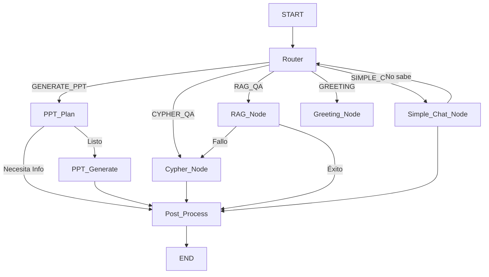

# Xpider Huelva: Asistente Inteligente de Contratación

Este proyecto implementa un asistente conversacional avanzado diseñado para el área de contratación de la Diputación de Huelva. Utiliza tecnologías de **RAG (Retrieval-Augmented Generation)**, **Grafos de Conocimiento (Neo4j)** y **Agentes (LangGraph)** para responder preguntas complejas, realizar análisis de datos y generar borradores de pliegos técnicos.

---

## 📚 Guía de Uso y Prompts

El asistente es capaz de manejar diferentes tipos de intenciones. A continuación se detallan ejemplos de cómo interactuar para obtener los mejores resultados.

### 1. Consultas Generales (RAG)
Preguntas sobre contenido textual de los pliegos (normativa, cláusulas, objetos de contrato).
* **Ejemplo 1**: _"¿Cuáles son los criterios de solvencia técnica para contratos de limpieza?"_
* **Ejemplo 2**: _"Resúmeme el objeto del contrato del expediente 22suAS58."_
* **Ejemplo 3**: _"¿Qué dice la cláusula de protección de datos en los contratos de suministros?"_

### 2. Análisis de Datos (Cypher / Neo4j)
Preguntas que requieren agregación, conteo o filtrado estructurado sobre la base de datos de contratos.
* **Ejemplo 1**: _"Top 10 empresas por número de contratos ganados."_
* **Ejemplo 2**: _"¿Cuánto se ha adjudicado en contratos relacionados con limpieza?"_
* **Ejemplo 3**: _"Listar todas las adjudicaciones ganadas por la empresa Techfriendly."_

### 3. Generación de Documentos (PPT)
El asistente puede redactar borradores de **Pliegos de Prescripciones Técnicas** basándose en contratos previos similares.
* **Ejemplo 1**: _"Redacta un PPT para el suministro de un vehículo todoterreno 4x4 forestal."_
* **Ejemplo 2**: _"Necesito un pliego para la contratación de un servicio de desarrollo web con Next.js."_

> **Nota**: El sistema te pedirá aclaraciones si la petición es ambigua. Una vez confirmado, generará el documento siguiendo estrictamente la estructura de un pliego de referencia real, pero adaptando el contenido técnico a tu petición.

### 4. Chat sobre Historial (Memoria)
Puedes hacer preguntas de seguimiento sobre la información que el asistente acaba de mostrar, sin necesidad de volver a buscar.
* **Ejemplo 1**: _(Tras ver una tabla de empresas)_ _"¿A qué se dedica la tercera?"_
* **Ejemplo 2**: _"Súmame los importes de las dos primeras."_

---

## 🏗️ Arquitectura Técnica con LangGraph

El núcleo del chatbot está construido sobre **LangGraph**, una librería para orquestar flujos de agentes con estado. El sistema no es lineal; decide dinámicamente qué camino tomar (Router) en función de la pregunta del usuario.

### Estructura del Grafo

El flujo de decisión se modela como un grafo de estados (`StateGraph`). Aquí tienes una representación simplificada:



### Descripción de Nodos (`services/graph_nodes.py`)

1.  **`router_node`**: Cerebro del sistema. Analiza la pregunta y el historial para clasificar la intención (`GENERATE_PPT`, `CYPHER_QA`, `RAG_QA`, `SIMPLE_CHAT`, `GREETING`).
2.  **`cypher_node`**: Genera consultas Cypher (SQL para grafos) para interrogar a Neo4j. Valida la seguridad (solo lectura) y ejecuta la consulta.
3.  **`rag_node`**: Realiza búsquedas vectoriales híbridas (semántica + palabras clave) para encontrar fragmentos de texto relevantes en los documentos.
4.  **`ppt_plan_node`**: Fase de planificación de documentos. Decide si tiene suficiente información para escribir el PPT o si debe preguntar al usuario (bucle de feedback).
5.  **`ppt_generate_node`**: Ejecuta la escritura del documento. Utiliza un pliego de referencia ("One-Shot Learning") para copiar la estructura de capítulos exacta pero reescribiendo el contenido técnico.
6.  **`simple_chat_node`**: Atiende preguntas coloquiales o referencias al historial reciente (ej: "y la anterior?"). Si no puede responder, reenvía al Router (fallback).
7.  **`post_process_node`**: Formatea la respuesta final, genera preguntas sugeridas (follow-ups) y gestiona el resumen de la memoria para no desbordar la ventana de contexto.

---

## 📂 Estructura del Proyecto

*   `app.py`: Punto de entrada de **Chainlit**. Maneja la sesión de usuario y la UI.
*   `config.py`: Configuración global (modelos LLM, credenciales Neo4j, límites de tokens).
*   `services/`:
    *   `graph.py`: Definición del `StateGraph` y las aristas (edges) condicionales.
    *   `intent_router.py`: Lógica de clasificación de intenciones con LLM.
    *   `cypher.py`: Generación y corrección de consultas Cypher.
    *   `ppt_generation.py`: Lógica específica para redactar pliegos y exportar a Word.
    *   `neo4j_queries.py`: Librería de consultas predefinidas a la base de datos.
*   `prompts/`: Plantillas de texto (System Prompts) para instruir al LLM en cada tarea.

---

## 🚀 Instalación y Despliegue

### Requisitos
*   Python 3.10+
*   Neo4j Database (con plugin GDS y APOC recomendados)
*   LLM compatible con OpenAI API (GPT-4, Claude, o local via vLLM/Ollama)

### 1. Configuración local

```bash
# Crear entorno virtual
python3 -m venv .venv
source .venv/bin/activate

# Instalar dependencias
pip install -r requirements.txt

# Configurar entorno
cp .env.example .env
# (Edita .env con tus claves de API y conexión a Neo4j)

# Ejecutar en modo desarrollo (recarga automática)
chainlit run app.py -w
```

### 2. Despliegue (Systemd)

Para mantener el servicio activo en un servidor Ubuntu:

1.  Crear usuario `chainlit`.
2.  Clonar repo en `/home/chainlit/Xpider_Huelva`.
3.  Crear servicio `/etc/systemd/system/chainlit.service`:

```ini
[Service]
User=chainlit
WorkingDirectory=/home/chainlit/Xpider_Huelva
ExecStart=/home/chainlit/Xpider_Huelva/.venv/bin/chainlit run app.py --host 0.0.0.0 --port 8000
Restart=always
```
