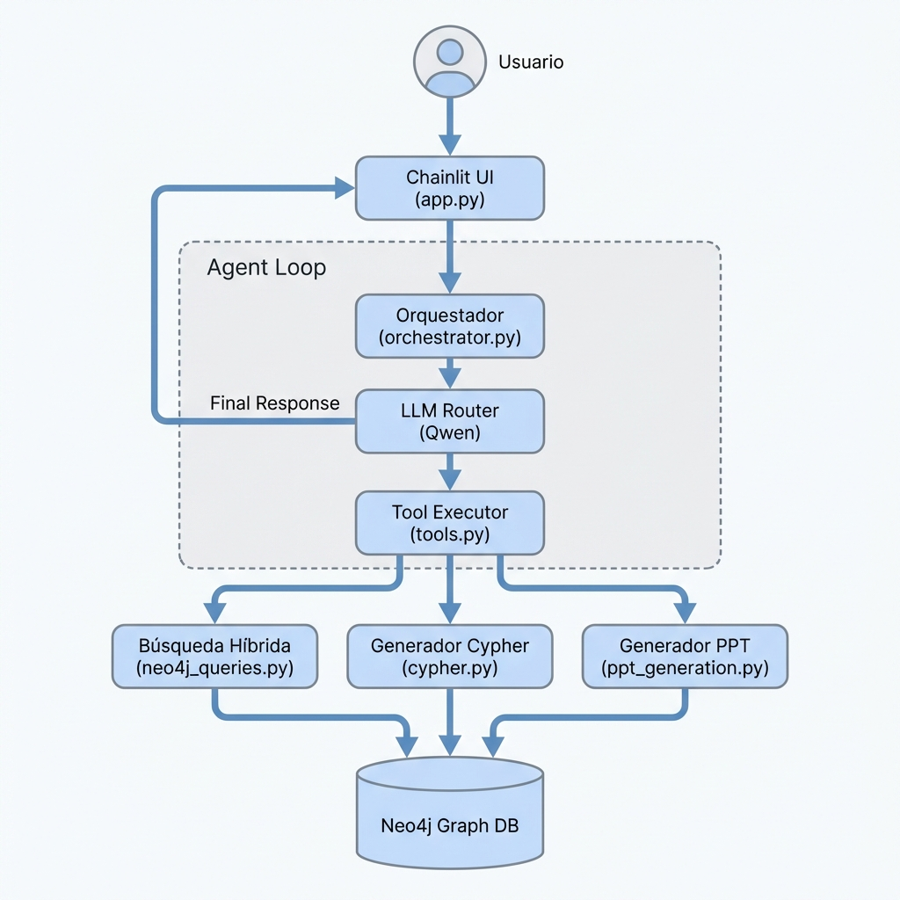

# Arquitectura del Chatbot de Contratación (V2)

Este documento describe la arquitectura técnica, los componentes principales y el flujo de datos del Asistente Virtual de Contratación de la Diputación de Huelva.

## 1. Visión General

El sistema es una aplicación **RAG (Retrieval-Augmented Generation)** orquestada, diseñada para interactuar con una base de datos de grafos (**Neo4j**) y generar documentación técnica (**PPT**).

### Componentes Principales

| Componente | Archivo Principal | Responsabilidad |
| :--- | :--- | :--- |
| **Frontend UI** | `app.py` | Interfaz de chat basada en **Chainlit**. Gestiona sesiones, assets (`public/`) y scripts personalizados (`force_scroll.js`). |
| **Orquestador** | `services/orchestrator.py` | El "cerebro". Gestiona el bucle de conversación, mantiene el historial y decide qué herramientas invocar usando el LLM. |
| **Herramientas** | `services/tools.py` | Implementación de las funciones ejecutables (buscar contratos, generar PPT, etc.). Actúa como puente entre el LLM y los servicios de datos. |
| **Capa de Datos** | `services/neo4j_queries.py` | Consultas Cypher pre-optimizadas para leer del grafo (Búsqueda vectorial + Búsqueda exacta). |
| **Analítica NL** | `services/cypher.py` | Motor "Text-to-Cypher". Traduce preguntas en lenguaje natural a consultas Cypher seguras para análisis de datos. |
| **Generador PPT** | `services/ppt_generation.py` | Lógica especializada para redactar pliegos y exportarlos a Word (`.docx`). |

---

## 2. Diagrama de Flujo (Arquitectura)

---

## 3. Detalle de Subsistemas

### A. Subsistema de Búsqueda Híbrida (`tools.py` + `neo4j_queries.py`)
Combina dos estrategias para encontrar información relevante:
1.  **Búsqueda Vectorial (RAG)**: Usa embeddings para encontrar contratos por similitud semántica.
2.  **Búsqueda Exacta**: Detecta patrones (Regex) de números de expediente (`2024/XM...`) o NIFs de empresas para consultas precisas.
3.  **Filtrado por Extractos**: Busca específicamente en nodos `ExtractoRAG` (cláusulas, requisitos técnicos) para responder preguntas sobre pliegos.

### B. Motor de Análisis de Datos (`cypher.py`)
Permite hacer preguntas tipo SQL ("Top 10 empresas", "Volumen total").
*   **Esquema Dinámico**: Inyecta un "Schema Hint" al prompt del LLM explicando que:
    *   `Obras` = CPV empieza por 45.
    *   `Fechas` = Se infieren del inicio del expediente (`24...` -> 2024).
*   **Seguridad**: Valida que la query generada sea `READ_ONLY` y corrige errores de sintaxis automáticamente.

### C. Generador de Documentos (`ppt_generation.py`)
Flujo especializado para crear Pliegos de Prescripciones Técnicas:
1.  **Contexto**: Recupera capítulos de un contrato de referencia similar.
2.  **Prompting**: Construye un prompt masivo con la estructura del contrato antiguo.
3.  **Anti-Hallucination**: Usa penalizaciones altas (`frequency_penalty=1.0`) y directivas de parada para evitar bucles de texto infinito.
4.  **Exportación**: Convierte el Markdown generado a `.docx` usando `python-docx`.

---

## 4. Dependencias Clave
*   **Chainlit**: Framework de UI.
*   **LLM Backend**: Modelos compatibles con OpenAI API (actualmente **Qwen3-A30-3B**).
*   **Embeddings**: Modelo **qwen-0.6-embedding**.
*   **Neo4j Driver**: Conexión a la base de datos de grafos.
*   **Pandas**: Procesamiento de datos tabulares y visualización.
*   **Python-docx**: Generación de archivos Word.

## 5. Flujo de Datos (Ejemplo: "Generar PPT")
1.  **Usuario**: "Genera un PPT para este contrato".
2.  **Orquestador**: Detecta intención y llama a `generate_document`.
3.  **Tool**: Lee `session_state["last_contract_expediente"]` para saber el contexto.
4.  **PPT Generation**:
    *   Busca en Neo4j el `doc_id` del PPT asociado.
    *   Descarga el texto completo de los capítulos.
    *   Envía al LLM: "Escribe un nuevo PPT para [Requerimiento Usuario] basándote en la estructura de [Contrato Referencia]".
5.  **Streaming**: El texto se genera token a token en la UI.
6.  **Entrega**: Se genera un enlace de descarga al archivo `.docx`.
